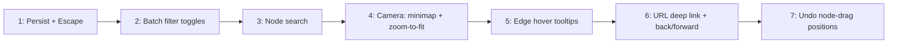

# Atlas — UX Improvements: Search, Navigation, Discovery & Position Undo

> This is a phase-agnostic addendum. Requirements are self-contained.
> Cursor: read this document in full before implementing any session in it.
> Phase placement: Sessions 1–5 ship incrementally at any time. Sessions 6
> (deep linking) and 7 (drag undo) overlap with Phase 3b's "Search" and
> "Permalinks" deliverables (`ATLAS_PHASE3B_SPEC.md` §"In scope") and
> formally satisfy them for the concept and variable layers; remaining
> layers fold in as Phase 3b activates them.

---

## Problem statement

The post-Phase-3a Atlas interface is functional but expensive to navigate.
Concrete frictions, observed during authoring and student preview use:

1. **No way to find a node by name.** With 10 concepts the graph is
   scannable; at 60+ (Phase 3b's curriculum scope) it will not be. The
   only way to "go to" a concept today is to spot it visually and click
   it.
2. **State is not shareable.** Selecting a node, panning to it, or
   hiding domains produces a screen that cannot be sent to a TA or
   bookmarked. There is no URL representation of session state beyond
   `?include=draft`.
3. **Navigation is one-way.** Clicking through panel links
   (`Prerequisites`, `Enables`, `Appears in`) walks the graph forward
   with no back affordance. Re-finding the previous concept requires
   either pan+search-by-eye or the user remembering the title.
4. **Drag mistakes are sticky.** A misplaced node can only be undone
   via `Reset selected`, which is a coarse, irreversible operation
   that snaps to the canonical pin. A common case — drag, realize you
   liked it where it was, want it back — has no fast recovery.
5. **Filter state has weak feedback and no batch controls.** When five
   domains are visible and the user wants only one, they tap five
   times. There is no `All`/`None`. The graph also gives no chrome-
   level indicator that domains are hidden, which has produced "where
   did the nodes go?" confusion.
6. **No spatial overview.** Once panned away from origin, there is no
   minimap and no `Fit graph` button. The user must manually zoom out.
7. **Two persistence gaps.** Panel drawer width and (until the in-
   flight `auto_recenter` change lands) several preferences reset on
   every reload.
8. **Edges carry semantic information that the UI does not surface.**
   Edge type (`foundational`, `uses-variable`, `definitional`, etc.)
   is encoded only in stroke style. There is no hover-level affordance
   to read the relationship.
9. **Keyboard escape hatch is missing.** `Escape` does not close the
   detail panel. There is no global shortcut surface at all.

This spec defines seven self-contained sessions that close these gaps
without expanding scope into new pedagogical surfaces.

---

## Design constraints inherited from the corpus

Solutions in this spec MUST preserve the following commitments. They
are not negotiable; if a proposal here conflicts, this document loses.

- **Layer = shape, domain = color** (`ATLAS_MAIN_SPEC.md` §"Visual
  encoding budget"). Nothing in this spec changes node geometry or
  domain encoding.
- **Layout is computed once per session and cached**
  (`ATLAS_PHASE3A_SPEC.md`; `ATLAS_REVEAL_NEIGHBORS_SPEC.md`
  §"Layout Model"). No session here triggers layout recomputation.
  Search jump, deep-link selection, undo-restore, and `Fit graph` are
  viewport/state operations only.
- **Floating-edge math is circle-centric** (`ATLAS_PHASE3A_SPEC.md`
  Sessions 3 + 7). Edge tooltip rendering must not alter the edge
  path or its endpoint geometry.
- **Hover ≠ select** (`ATLAS_REVEAL_NEIGHBORS_SPEC.md` §"What This Is
  Not"). Edge tooltips are peeks; they do not enter selection state.
- **Authored canonical layout is the single source of truth on disk**
  (`ATLAS_LAYOUT_AUTHORING_SPEC.md`). User-dragged positions live in
  a separate runtime store. Drag-undo operates on the runtime store
  only and never mutates canonical JSON.
- **Selection is the user's anchor for "what am I studying."** Search
  and back/forward navigation move selection; they do not collapse
  it (no transient highlight-only mode).
- **Mobile parity is non-optional** (`ATLAS_PHASE3B_SPEC.md` §"In
  scope"). Every visible affordance added by this spec has a mobile
  surface, either inline on the canvas or inside
  `MobileControlsOverlay`.

---

## Session sequencing rationale

Sessions are ordered from lowest to highest blast radius. Earlier
sessions touch isolated files and add no global listeners; later
sessions wire window-level state (history API, keyboard shortcuts) and
extend the user-layout store. This ordering minimizes the chance that
a regression at session N looks like a bug introduced in session N-3.



The arrows are recommended order, not hard dependencies. Sessions 1–5
have zero coupling between them and can land in any order. Session 7
may piggyback on Session 6's history infrastructure (treating drag-
undo as a separate stack) but does not require it.

Each session is scoped to a single PR with its own commit and its own
test additions. No session leaves the codebase in an intermediate
state where another session is required to make the feature usable.

---

## Session 1 — Panel-width persistence and Escape-to-close

The smallest, most isolated session. Establishes a pattern that later
sessions reuse for their preference storage.

### Rationale

The detail panel has a drag-resizable left edge on desktop. Its width
is in component state and resets on every reload. This penalizes the
common case of a power user who has chosen a comfortable width.
Persisting it costs four lines of glue and matches the existing
`atlas_auto_recenter_v1` pattern.

`Escape` is the most universal "I'm done with this overlay" gesture
in the web UI vocabulary. The panel currently ignores it. Adding a
window-level handler that clears `selectedNodeId` is a one-time
investment that pairs naturally with the search input (Session 3),
which will use `Escape` to close the dropdown without clearing the
graph selection.

### Contract

- New localStorage key: `atlas_panel_width_v1`. Stored value is the
  numeric pixel width as a string. Read on mount via a
  `readInitialPanelWidth()` helper that parses, clamps to
  `[DESKTOP_MIN_PANEL_WIDTH, viewportWidth * 0.55]`, and falls back
  to `DEFAULT_PANEL_WIDTH_FALLBACK` on parse failure or storage
  unavailability. Mirror the structure of `readInitialAutoRecenterEnabled`
  in [atlas/src/App.jsx](atlas/src/App.jsx).
- A `useEffect` writes the current `panelWidth` whenever it changes,
  inside the same try/catch shape as existing keys.
- A window `keydown` listener installed by App calls
  `setSelectedNodeId(null)` when ALL of the following hold:
  1. `event.key === 'Escape'`
  2. `selectedNodeId` is currently truthy
  3. `document.activeElement` is not an `<input>`, `<textarea>`, or
     element with `[contenteditable="true"]`
- The handler does not call `preventDefault` on `Escape` when it is
  not consuming the event, so dialogs and OS-level handlers continue
  to work.

### File footprint

- [atlas/src/App.jsx](atlas/src/App.jsx) — new helper, new effect, new
  handler.
- New tests in `atlas/src/__tests__/App.test.jsx` (or extension of an
  existing App test file if present).

### Acceptance criteria

- Resizing the panel, reloading, and observing the same width.
- `Escape` with the panel open closes it; `Escape` with focus inside
  the search input (added later in Session 3) does NOT close the
  panel.
- `Escape` is a no-op when the panel is already closed.
- Width is clamped on reload if the viewport has narrowed below the
  stored value.

### Out of scope

- Persisting the panel's bottom-sheet height on mobile (the bottom
  sheet has no resize handle).

---

## Session 2 — All / None batch toggles for domains and layers

### Rationale

The existing per-domain and per-layer chips are correct affordances
but assume the user wants to flip a small number of bits. The
"focus on one domain" task currently costs one click per *non-target*
domain. This grows linearly with corpus size; at Phase 3b scope (six
or more domains) it is the dominant interaction cost of filtering.

Two prefix chips — `All` and `None` — make the batch case constant
time. They are visually distinct enough from the per-domain chips
(no color swatch, label-only) that they do not get confused for a
domain.

### Contract

- [atlas/src/components/DomainFilterPanel.jsx](atlas/src/components/DomainFilterPanel.jsx)
  gains two leading buttons: `All` (sets `visibleDomains` to a `Set`
  containing every domain key) and `None` (sets it to the empty
  set).
- [atlas/src/components/LayerToggleBar.jsx](atlas/src/components/LayerToggleBar.jsx)
  gains the same two buttons. `None` for layers must respect the
  Phase 3b lockout: layers without a `schema_validator` remain
  disabled regardless. Calling `None` then `All` should restore
  prior availability without flipping a disabled layer on.
- [atlas/src/App.jsx](atlas/src/App.jsx) computes `allDomainKeys` and
  `allLayerKeys` once via `useMemo` and passes both sets through
  `MobileControlsOverlay` for parity.
- The `All` button is visually muted when the set is already
  complete; `None` is muted when the set is empty.

### File footprint

- [atlas/src/components/DomainFilterPanel.jsx](atlas/src/components/DomainFilterPanel.jsx)
- [atlas/src/components/LayerToggleBar.jsx](atlas/src/components/LayerToggleBar.jsx)
- [atlas/src/App.jsx](atlas/src/App.jsx) — new memoized sets, two new
  callbacks per filter type.
- [atlas/src/components/MobileControlsOverlay.jsx](atlas/src/components/MobileControlsOverlay.jsx) — pass-through props.

### Acceptance criteria

- Clicking `All` on domains makes every domain visible regardless of
  prior state.
- Clicking `None` on domains hides every domain, which (per existing
  visibility rules in `GraphCanvas.jsx`) also hides all variable
  nodes that lack a visible-concept neighbor.
- `None` on layers does not flip an unbuilt layer's visibility on
  when `All` is clicked next.
- Per-chip toggles continue to work after batch operations.

### Out of scope

- A "previous selection" undo for filter changes. If users ask, that
  can ship later as a single undo step keyed by filter scope.

---

## Session 3 — Node search / jump-to

### Rationale

Search is the highest-leverage navigation affordance in any graph at
scale. The `ATLAS_PHASE3B_SPEC.md` §"In scope" line *"Search across
all entity layers (concepts, variables, problems, labs, experiments)
by title, formula, tag, variable symbol"* names this feature
explicitly. This session ships the concept- and variable-layer slice
of that requirement now; problem/lab/experiment search lights up as
those layers populate.

A new component is preferred over wiring search into an existing
panel because (a) the search affordance must be reachable on both
desktop and mobile from the top of the chrome stack, and (b) keeping
it isolated lets it be replaced by a fuzzy-search library in a later
session without churning unrelated files.

### Contract

- New file: `atlas/src/components/NodeSearch.jsx`.
- Props:
  ```ts
  {
    nodes: Array<{ id: string, title?: string, layer: string,
                   domain?: string }>,
    onSelectNode: (nodeId: string) => void,
    isMobile?: boolean,
  }
  ```
- Substring match (case-insensitive) against `title`, `id`, and
  variable `canonical_symbol` if present. Result list capped at 8
  rows. Variable rows render the symbol via `KatexText`; concept
  rows render plain text.
- Keyboard model:
  - `ArrowDown` / `ArrowUp` move highlight within the list.
  - `Enter` selects the highlighted row, calls `onSelectNode`,
    closes the dropdown, clears the query.
  - `Escape` closes the dropdown without changing graph selection
    and without bubbling to the App-level `Escape` handler from
    Session 1 (the App handler's input-focus exclusion already
    covers this).
- Mounted in two places, both passing the same `nodes` array
  derived from the existing entity loader:
  1. Desktop: a top slot in the existing left chrome stack in
     [atlas/src/App.jsx](atlas/src/App.jsx), above `LayerToggleBar`.
  2. Mobile: top of the `MobileControlsOverlay` sheet.
- Selecting a result calls `setSelectedNodeId(id)`. The existing
  `CameraController` recenters automatically (on mobile and
  desktop). No new camera plumbing.

### File footprint

- `atlas/src/components/NodeSearch.jsx` (new)
- [atlas/src/App.jsx](atlas/src/App.jsx) — render in chrome stack
- [atlas/src/components/MobileControlsOverlay.jsx](atlas/src/components/MobileControlsOverlay.jsx) — render at top of sheet
- New `atlas/src/components/__tests__/NodeSearch.test.jsx`.

### Acceptance criteria

- Typing matches against title, id, and variable symbol; the result
  count never exceeds 8.
- Arrow keys cycle highlight and wrap at top/bottom.
- `Enter` on a highlighted row selects that node (graph selection +
  panel open) and the existing recenter logic fires.
- `Escape` closes the dropdown without clearing graph selection.
- Selecting a result is observable in `userMoveEndCount` semantics:
  the change is treated as a programmatic recenter (not a user pan)
  per existing `CameraController` rules, so no idle-recenter timer
  is queued.

### Out of scope

- Fuzzy / typo-tolerant matching. Substring is sufficient at corpus
  scale for this session; revisit when the entity count > 200.
- Recently-selected history in the dropdown. Session 6's URL
  deep-link infrastructure provides the same recall via the
  browser's history.

---

## Session 4 — Minimap and viewport buttons

### Rationale

Two related viewport gaps:

- **Spatial overview.** When zoomed in on a neighborhood, the user
  has no peripheral sense of where they are in the larger graph.
  React Flow ships a `<MiniMap>` component that does exactly this
  with no incremental layout cost.
- **No "go home" affordance.** After dragging or zooming aimlessly,
  the only way back to a useful framing is to manually pan and
  scroll. `Fit graph` and `Center selected` are the two buttons
  every graph UI eventually grows.

These are bundled because they share the React Flow viewport API
boundary (`useReactFlow` + `fitView` + `setCenter`) and the same
mobile-vs-desktop visibility decision.

### Contract

- [atlas/src/components/GraphCanvas.jsx](atlas/src/components/GraphCanvas.jsx)
  renders `<MiniMap>` next to the existing `<Controls>` and
  `<Background>`. Disabled (not rendered) on mobile to preserve
  bottom-sheet space. Node fill is sourced from the same domain
  palette that drives `nodes/domainVisuals.js`.
- [atlas/src/components/graph/LayoutControls.jsx](atlas/src/components/graph/LayoutControls.jsx)
  gains two buttons in a new top row of the existing card:
  - `Fit graph` — calls `reactFlow.fitView({ padding: 0.2,
    duration: 320 })`.
  - `Center selected` — disabled when `!selectedNodeId`. Calls the
    existing `centerOnNode` helper used by `CameraController`.
- The `fitView` action requires `useReactFlow` access. Plumb it via
  a callback prop set inside `GraphCanvas` (which is already inside
  `<ReactFlowProvider>`) so that `LayoutControls` itself does not
  import React Flow APIs. Specifically, `GraphCanvas` constructs
  `handleFitView` and passes it to `LayoutControls`.

### File footprint

- [atlas/src/components/GraphCanvas.jsx](atlas/src/components/GraphCanvas.jsx) — render `<MiniMap>`, build `handleFitView`,
  pass two new callbacks down.
- [atlas/src/components/graph/LayoutControls.jsx](atlas/src/components/graph/LayoutControls.jsx) — two new buttons; add
  `onFitGraph` and `onCenterSelected` props (typed in JSDoc).
- [atlas/src/components/MobileControlsOverlay.jsx](atlas/src/components/MobileControlsOverlay.jsx) — propagate the new
  callbacks for the mobile inline `LayoutControls`.
- Test extensions in [atlas/src/components/__tests__/GraphCanvas.test.jsx](atlas/src/components/__tests__/GraphCanvas.test.jsx).

### Acceptance criteria

- `<MiniMap>` renders only when `isMobile === false`.
- Clicking `Fit graph` calls `fitView` with the documented options.
- Clicking `Center selected` calls `setCenter` with the same offset
  math `CameraController` uses (panel-aware on desktop, raw center
  on mobile). Reuse, do not duplicate.
- `Center selected` is disabled and does nothing when no node is
  selected.

### Out of scope

- Minimap interactivity (click-to-pan). React Flow's default
  behavior is sufficient; do not add custom click handlers.
- Animated minimap transitions. Default rendering is fine.

---

## Session 5 — Edge hover tooltips

### Rationale

Edge type carries real semantic content — `foundational`,
`uses-variable`, `definitional`, `lateral`, `supporting` — that the
UI today encodes only in stroke style. A student looking at two
parallel edges between the same pair of concepts has no way to read
which is which without inspecting source JSON.

A native SVG `<title>` element solves this with zero new state and
zero rendering cost. It is announced by screen readers, surfaced as
a browser tooltip on hover, and survives selection-emphasis style
changes.

### Contract

- [atlas/src/components/FloatingEdge.jsx](atlas/src/components/FloatingEdge.jsx) gains a small mapping table:
  ```js
  const EDGE_TYPE_LABELS = {
    foundational:    'Foundational principle',
    'uses-variable': 'Uses variable',
    'defines-variable': 'Defines variable',
    definitional:    'Definition',
    lateral:         'Lateral connection',
    supporting:      'Supporting concept',
    isomorphic:      'Isomorphic structure',
    'noether-consequence': 'Noether consequence',
    applies:         'Applies concept',
    instantiates:    'Instantiates concept',
    establishes:     'Establishes concept',
  }
  ```
- An unknown edge type falls back to a label of the literal `type`
  string with hyphens replaced by spaces and the first letter
  uppercased. This guards against future edge types added before the
  table is updated.
- A `<title>` element is rendered as the first child of the edge
  `<g>`, with text content `EDGE_TYPE_LABELS[type] ?? fallback`.

### File footprint

- [atlas/src/components/FloatingEdge.jsx](atlas/src/components/FloatingEdge.jsx)
- New tests in `atlas/src/components/__tests__/FloatingEdge.test.jsx`
  (create if absent) covering the mapping and the fallback.

### Acceptance criteria

- Hovering an edge in a desktop browser shows the labeled tooltip
  after the OS-default delay.
- Edges of unknown future types still render a sensible
  human-readable label.
- Edge selection-emphasis styles (focal/neighbor/distant) continue
  to apply unchanged.

### Out of scope

- A custom positioned tooltip component. If product feedback
  requests one (e.g., for richer formatting), that is a follow-up
  spec and not part of this session.
- Touch-equivalent of hover. Mobile keeps panel-driven discovery
  via the panel's "Prerequisites/Enables" sections.

---

## Session 6 — URL deep linking and browser back/forward

This is the largest cross-cutting session in this spec. It satisfies
`ATLAS_PHASE3B_SPEC.md`'s "Permalinks: `/entity/:id` URL routing"
deliverable for the concept and variable layers, using query
parameters (no router) to keep the diff small and avoid introducing
React Router as a dependency for one feature.

### Rationale

A user-shareable URL for "the concept I'm currently looking at" is
the difference between "look at this graph and find Ohm's law" and
"open this link." It is also the precondition for every analytics,
TA-feedback, and lecture-link workflow Atlas wants in Phase 3b/4.

A second, almost-free win comes with it: the browser's history API
provides back/forward navigation through visited concepts at no
additional state cost. Pushing a history entry on selection change
and listening for `popstate` is enough.

### Contract

- URL shape (initial cut):
  ```
  /?node=<entityId>
  ```
  Optional and additive in this same session, contingent on diff
  size:
  ```
  /?node=<id>&domains=mech,thermo&layers=concept,variable
  ```
  If the additive parameters meaningfully grow the diff, ship them
  in a follow-up session and gate this session on `node=` only.
- Read on mount: in [atlas/src/App.jsx](atlas/src/App.jsx), parse
  `URLSearchParams` once after entity load. If `node` resolves to a
  known entity id, seed `selectedNodeId` to it. Unknown ids are
  silently ignored (no toast, no console error).
- Write on change: when `selectedNodeId` transitions to a non-null
  value, call:
  ```js
  history.pushState({ nodeId: id }, '', urlWithNodeParam(id))
  ```
  When `selectedNodeId` transitions to `null`, call:
  ```js
  history.pushState({ nodeId: null }, '', urlWithoutNodeParam)
  ```
  Skip the push if the URL already represents the same state
  (prevents duplicate history entries from re-clicking the same
  node).
- `popstate` handler reads the URL fresh and updates
  `selectedNodeId`. The handler is registered once on mount and
  removed on unmount.
- Initial mount uses `replaceState`, not `pushState`, so the user
  can use browser-back to return to wherever they came from before
  Atlas.
- `?include=draft` is preserved untouched by all URL-rewriting code
  paths.

### File footprint

- [atlas/src/App.jsx](atlas/src/App.jsx) — mount-time read, on-change
  write, `popstate` listener, two small URL helper functions.
- New test additions in `App.test.jsx` covering:
  - Read on mount with valid id.
  - Read on mount with unknown id (no crash, no selection).
  - Write on selection change.
  - Round-trip via simulated `popstate`.
  - Dedupe: clicking the same node twice produces one history entry.
  - `?include=draft` survives a selection-driven URL update.

### Acceptance criteria

- Reload preserves the selected concept.
- Pasting a URL containing an unknown `node=` opens Atlas with no
  selection and no error.
- Browser back/forward walks selection history in the order it was
  generated.
- Closing the panel via X or `Escape` (Session 1) removes `node=`
  from the URL.
- The history is not polluted by re-clicking the same already-
  selected node.

### Out of scope

- A `/entity/:id` route shape. That requires a router and is
  deferred until Phase 3b's full permalink work.
- Server-side rendering of titles for link unfurling. Atlas remains
  a Vite SPA in this session.

---

## Session 7 — Undo for node-position drags

### Rationale

The user-layout store is the runtime override on top of the canonical
authored layout (`ATLAS_LAYOUT_AUTHORING_SPEC.md`). Today the only
recovery from an unwanted drag is `Reset selected`, which discards
the override entirely. This is correct as a "blow it away" tool but
wrong as the everyday recovery for "I dragged it 20 pixels and meant
to drag it 10."

A bounded undo buffer over the user-layout store fixes this without
introducing global undo semantics anywhere else in the app. Drag
positions are the only reversible operation in scope here.

### Contract

- New ring buffer in [atlas/src/App.jsx](atlas/src/App.jsx):
  ```ts
  type DragSnapshot = { nodeId: string,
                        prevPosition: { x: number, y: number } | null }
  ```
  Cap: 20 entries. Newest pushed on the right, oldest evicted on
  the left.
- Snapshot is taken inside `handleNodePositionCommit` BEFORE the
  user-layout store is updated:
  ```js
  const prev = userLayoutStore[nodeId]?.position ?? null
  pushUndoSnapshot({ nodeId, prevPosition: prev })
  ```
  Then the existing write proceeds unchanged.
- `Reset selected` also pushes a snapshot of the current override
  before clearing, so the reset itself is undoable.
- `Reset to canonical` and `Import layout` clear the buffer
  entirely. Different baseline, prior snapshots are no longer
  meaningful.
- UI surfaces:
  1. A new `Undo last move` button in
     [atlas/src/components/graph/LayoutControls.jsx](atlas/src/components/graph/LayoutControls.jsx),
     placed in a new bottom row. Disabled when the buffer is empty.
  2. A window-level `keydown` handler for `Ctrl+Z` (Windows/Linux)
     and `Cmd+Z` (macOS). Skipped when the active element is an
     `<input>`, `<textarea>`, or contenteditable, mirroring the
     Session 1 exclusion. `Shift+Cmd+Z` / `Ctrl+Y` (redo) is
     explicitly NOT implemented in this session.
- On undo: pop the most recent snapshot, write the prior position
  back to the user-layout store via the existing
  `persistNextUserLayoutStore` callback. If `prevPosition` was
  `null` (i.e., before this drag the node had no override), remove
  the override entry rather than writing a `null` position.

### File footprint

- [atlas/src/App.jsx](atlas/src/App.jsx) — buffer state, snapshot
  push, undo function, keyboard handler, lifecycle (clear on reset
  / import).
- [atlas/src/components/graph/LayoutControls.jsx](atlas/src/components/graph/LayoutControls.jsx) — new button row.
- [atlas/src/components/MobileControlsOverlay.jsx](atlas/src/components/MobileControlsOverlay.jsx) — pass through new
  prop for the mobile-inline copy.
- Test additions in `App.test.jsx`:
  - Undo restores the prior position.
  - Undo when buffer is empty is a no-op.
  - Buffer evicts oldest beyond cap.
  - `Reset to canonical` and import both clear the buffer.
  - `Cmd/Ctrl+Z` is ignored while typing in inputs.
  - Undo where `prevPosition` was `null` removes the override
    (does not store `null`).

### Acceptance criteria

- Drag a node, click `Undo last move`, node returns to its prior
  visual position.
- 21 sequential drags + 21 undos works correctly: the 21st undo is
  a no-op (the oldest snapshot was evicted by the 21st drag).
- After `Reset to canonical`, the undo button is disabled.
- `Cmd+Z` while focused inside the search input does NOT undo.

### Out of scope

- Redo. Adding a redo stack doubles the state and the ergonomic
  contract; users have not asked for it. If/when they do, ship it
  as its own session.
- Multi-node undo (e.g., undoing a multi-select drag). Atlas does
  not support multi-select drags today; this session inherits that
  limitation.

---

## Cross-session conventions

These apply identically across sessions and are called out here so
each session description above can stay short.

### Persistence keys

All new localStorage keys follow the established naming convention:

```
atlas_<feature>_v1
```

Read helpers always wrap access in try/catch and fall back to a
sensible default on failure. Write effects do the same.

### Mobile parity

For each session that adds a desktop affordance, the corresponding
mobile surface is:

- Session 1: Escape and width persistence are functional on mobile
  (Escape only matters when an external keyboard is attached).
- Session 2: All/None chips render in the mobile sheet copies of
  `DomainFilterPanel` and `LayerToggleBar`.
- Session 3: `NodeSearch` mounts at the top of `MobileControlsOverlay`.
- Session 4: `<MiniMap>` is desktop-only by design; viewport
  buttons render in the mobile-inline `LayoutControls`.
- Session 5: SVG `<title>` is hover-only; mobile users discover
  edge semantics via the panel link sections (unchanged behavior).
- Session 6: deep linking is platform-agnostic; mobile browser
  back/forward gestures work identically.
- Session 7: `Undo last move` button is in the mobile sheet copy
  of `LayoutControls`. Keyboard shortcut is desktop-only.

### Test discipline

Every session adds at least one test file or extends an existing one
under `atlas/src/components/__tests__/` or `atlas/src/__tests__/`.
Test names describe behavior, not implementation. Existing
`GraphCanvas.test.jsx` is the model for camera-touching tests.

### Git hygiene

Each session is one PR. Commit message body cites the session number
(`Session 4: minimap + viewport buttons`) so that a later bisect can
land on a session boundary.

---

## Out of scope for this entire spec

The following are intentionally deferred. They appeared in the
original brainstorm and were either declined or scheduled separately.

- **Frontier mode toggle.** The frontier-pulse highlighting is
  always-on. Adding a user toggle is a pedagogical surface, not a
  UX gap, and belongs in a learning-mode spec.
- **Progress chip / understanding summary.** Same reason.
- **Variable cross-highlight on panel hover.** Pleasant but
  non-essential; revisit after Session 5 lands and we have a feel
  for how often users want bidirectional cues.
- **Filter-state-changed indicator badge.** May fold in if Session
  2's batch toggles do not on their own resolve the "where did the
  nodes go?" confusion.
- **Rich custom edge tooltip component.** Session 5 ships native
  `<title>`; richer rendering is a follow-up.
